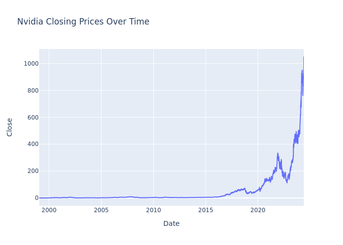
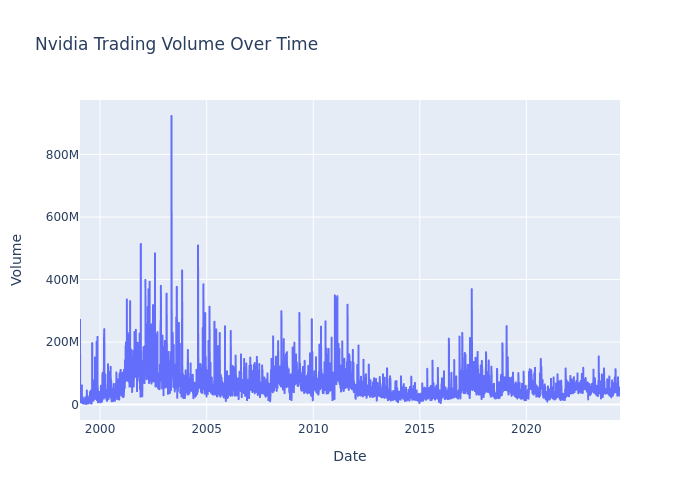
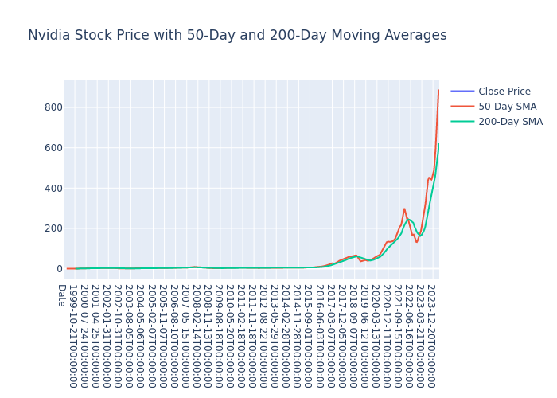
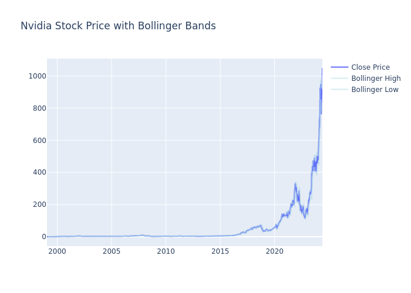
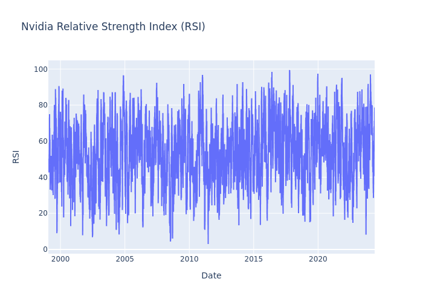

# Nvidia-Stock-Analysis-1999-2024

This repository contains an analysis of Nvidia's historical stock data, focusing on various technical indicators and trends. The analysis was performed using Python and Plotly, with visualizations exported as both interactive HTML files and static PNG images for easy viewing.

## Dataset

The dataset consists of Nvidia's historical stock prices, including the following columns:

- **Date**: The date of the stock data.
- **Open**: The opening price of the stock on that date.
- **High**: The highest price of the stock on that date.
- **Low**: The lowest price of the stock on that date.
- **Close**: The closing price of the stock on that date.
- **Adj Close**: The adjusted closing price of the stock on that date (adjusted for dividends and stock splits).
- **Volume**: The volume of shares traded on that date.

## Analysis and Visualizations

### Summary Statistics

The summary statistics provide a comprehensive overview of Nvidia's stock performance over the observed period. Key insights include:

- The stock prices have a wide range, with the closing price reaching a maximum of $1049.01.
- The average closing price is approximately $53.91, indicating significant price increases over time.
- The trading volume shows substantial variation, with an average volume of around 60 million shares and a maximum of over 923 million shares, suggesting periods of heightened trading activity.

### Visualizations

#### Nvidia Closing Prices Over Time

This line chart illustrates the closing prices of Nvidia's stock over time, revealing a general upward trend and periods of significant volatility.

#### Nvidia Trading Volume Over Time

This line chart shows the trading volume of Nvidia's stock over time, highlighting peaks in trading activity that often coincide with major market events or significant company news.

#### Nvidia Stock Price with 50-Day and 200-Day Moving Averages

This chart includes Nvidia's closing price along with the 50-day and 200-day Simple Moving Averages (SMAs), providing insight into short-term and long-term trends.

#### Nvidia Stock Price with Bollinger Bands

This chart depicts Nvidia's stock price with Bollinger Bands, illustrating periods of high and low volatility.

#### Nvidia Relative Strength Index (RSI)

This line chart shows the Relative Strength Index (RSI) for Nvidia's stock, helping to identify overbought and oversold conditions.

### Interactive HTML Files

For a more interactive experience, you can view the following HTML files:
- [Nvidia Closing Prices Over Time](./plots/nvidia_closing_prices.html)
- [Nvidia Trading Volume Over Time](./plots/nvidia_trading_volume.html)
- [Nvidia Stock Price with 50-Day and 200-Day Moving Averages](./plots/nvidia_moving_averages.html)
- [Nvidia Stock Price with Bollinger Bands](./plots/nvidia_bollinger_bands.html)
- [Nvidia Relative Strength Index (RSI)](./plots/nvidia_rsi.html)

## Insights

The comprehensive analysis of Nvidia's stock data reveals several key trends and insights:

1. **Long-Term Growth**: Nvidia's stock has exhibited substantial growth over the observed period, with notable increases in the closing price.
2. **Volatility**: The stock has experienced periods of significant volatility, as indicated by the fluctuating trading volume and the width of the Bollinger Bands.
3. **Trend Analysis**: The moving averages provide insight into the short-term and long-term trends, helping to identify potential bullish and bearish signals.
4. **Market Sentiment**: The RSI helps in understanding market sentiment by identifying overbought and oversold conditions, providing cues for potential buying or selling opportunities.

## Conclusion

This analysis provides valuable insights into Nvidia's stock performance, helping investors make informed decisions based on historical trends and technical indicators. 